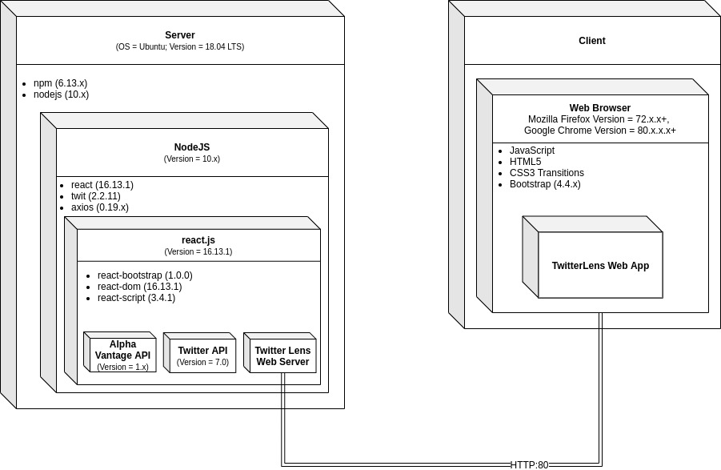

 

# Twitter Lens

## Viewing Twitter through a custom Lens

_A Git Push Git Paid Project: We are the masters of our craft_

__Contact:__ TwitterLensDev@gmail.com


# Our Vision

## Executive Summary 

TwitterLens is a tool that utilizes live stock market data in tandem with relevant Tweets 
from Twitter in order to inform investors and day traders of live market sentiment. TwitterLens will consist of a website similar to a search engine, where the user can search for a company to view related tweets and statistics. Users may apply filters to narrow down the search to specific categories, such as Tweets that were published by market analysts rather than the general customer, or vice versa. This tool will show the correlation between stock price and public sentiment, providing invaluable insight that goes beyond the news and price charts. 

## Features 

This project has a bunch of features that makes the project valuable. One key feature of 
TwitterLens is data visualization of a company’s Twitter buzz over a period of time. Another key feature of the project is that it compares the visualized Twitter buzz over a period of time for a company to the company’s stock prices over that same period of time. The project also makes use of a custom filter feature to filter out irrelevant data in searches.

## Business Case 

### Niche 

This project’s target audience is people who are investing in stocks and developers who 
are creating machine learning apps for investing. People who are new to investing in stocks need a nice, friendly place to start learning about companies. This project would be ideal to these people as it gives visualizations of a company’s Twitter buzz and the stock values over a set period of time. Developers who are creating machine learning apps for investing, need a way of collecting, cleaning, filtering, and using the data. TwitterLens would help these developers because it cleans, filters, stores, and visualizes crucial data which would reduce the amount of work they would need to put in to use the data. 

### Competition 

The Twitter advanced search function would be a competitor to this project. The Twitter 
advanced search allows you to search for posts between certain date ranges. Our project 
is better than this competitor because TwitterLens shows results for a company’s Twitter buzz and stock values over custom ranges, in addition to providing visualization for the data over the date range, and uses custom filters to filter out irrelevant data. Here is a link to the competition: https://twitter.com/ 

### Value for the Effort 

This project could be of great value to the community because it would allow people who 
are new to investing in stocks to look at visualized data about a given company to get an idea of which companies are doing well and which are not. The social impact from this could be that the project leads to more people getting involved in investing, which has great social value as it can positively affect peoples’ lives. This project can even be made into a product that will generate profit for the effort because it would be marketable to developers that are developing an investing app that uses machine learning. The way our project collects and manages the data would make it worth the investment, as it would make the developers’ lives easier.

### Risks of Product Success 

The product faces a couple barriers when it comes to selling the product. One barrier the 
product faces is that there is not a large number of developers who are developing investment apps so the demand for the app would not be very high. Another barrier is that developers may be looking for more data than what we would be storing, so they may not be as motivated to buy our product. 

## Stakeholders 

The stakeholders of this project are Professor John Sturman, Teaching Assistants Chau-Lin 
(Charley) Huang and Vaishnavi Neema, and team members Andrew Emanuel, Daniel Peladeau, Matthew Riina, Matthew Solomon, and Nicholas Nazario. Professor Sturman, Charley, and Vaishnavi have vested interest in our project because the success of the project is a direct reflection of their successful teaching. Professor Sturman has also noted that he lives to see his students be creative with their projects and succeed. The team members are stakeholders for this project because we are invested in the success of the project, as we want to bring our vision to life, to distribute our software to educate the community, and also it determines our grade in the class, which we have a vested interest in.


# Application Information
## Obtaining, Hiding and Using Your API Keys

The following instructions must be used to obtain Stock and Twitter API keys before running the web application:

Stock API
1. Navigate to the Alpha Vantage Support page at https://www.alphavantage.co/support/#api-key
2. Follow the instructions and add a valid email as well as an organization if you have one. 
3. Copy the Free API Key that appears on the webpage after you submit their form (keep in a safe place)

Twitter API
1. Navigate to the Stock Developer page to request a Developer account at https://developer.twitter.com/en/apply-for-access **NOTE** You must have a Twitter account to apply for a Twitter Developer account
2. Follow the instructions to apply for the Twitter Developer Account and request an api key by registering your application
3. Copy the consumer key, consumer secret, access token, and access token secret for later use  (keep in a safe place)

Hiding and Using Your API Keys
1. Create an environment variable file named .env in the twitterlens/client/src directory of the project
2. Inside the .env file, add your API key names and values to the file in the following format by replacing YOUR_API_KEY_GOES_HERE with the value of the corresponding API key: 
    ```
    // .env
    
    REACT_APP_STOCK_API="YOUR_API_KEY_GOES_HERE"

    TWITTER_CONSUMER_KEY=YOUR_API_KEY_GOES_HERE
    TWITTER_CONSUMER_SECRET_KEY=YOUR_API_KEY_GOES_HERE
    TWITTER_ACCESS_TOKEN=YOUR_API_KEY_GOES_HERE
    TWITTER_ACCESS_TOKEN_SECRET=YOUR_API_KEY_GOES_HERE
    ``` 
3. The .env file is a part of the .gitignore file so it will not be committed to your GitHub. 
    ```
    // .gitignore
    
    #api keys
    .env
    
    #dependencies
    /node_modules
    ...
    ```
    
## Running Web App

The following instructions can be used to run the web application

```bash
cd twitterlens/client
npm install
cd ..
npm install
npm start
```

## Domain Model


## Deployment Structure

 


# Team Practices

## Coding Standards

The Twitter Lens Team follows the ES6 coding standard for all JavaScript files

## Linters

The Twitter Lens Team used __ESLint__ as a javascript linter to enforce ES6 standards


## Third Party Components

1. Bootstrap, a free and open-source style sheet, is used to style our components
2. AlphaVantage, a stock data API, is used by Twitter Lens to collect stock pricing
3. Twitter's developer API is used by Twitter Lens to collect, filter, and display tweets
4. React.js, a free and open-source web framework, is used by Twitter Lens as the framework for the web application
